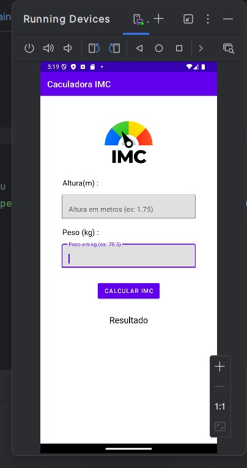
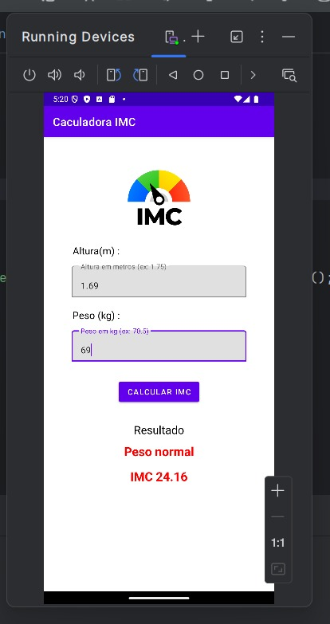

## 📱 Calculadora IMC - Android
Este é um projeto acadêmico desenvolvido para a disciplina de Desenvolvimento Mobile. O objetivo da aplicação é calcular o IMC (Índice de Massa Corporal) de uma pessoa com base em sua altura e peso informados.

## 💡 Sobre o App
A calculadora realiza o seguinte cálculo:

ini
Copy
Edit
IMC = Peso / (Altura * Altura)
Com base no resultado, o aplicativo informa a classificação do IMC, como:

Desnutrição

Magreza

Peso normal

Sobrepeso

Obesidade moderada

Obesidade severa

Obesidade mórbida

##

A interface é simples, intuitiva e responsiva, focada na experiência do usuário.

🖼️ Imagens do Projeto

Tela inicial sem dados:

Tela com dados preenchidos e resultado exibido:

## ⚙️ Tecnologias Utilizadas

- Kotlin

- Android Studio

- Material Design

- XML Layouts

## 📚 Objetivos de Aprendizado
- Prática com componentes de interface no Android

- Manipulação de inputs do usuário

- Cálculo e exibição de resultados com base em lógica

- Estilização e organização de layouts

## 📌 Como Rodar o Projeto
Clone o repositório:

bash
Copy
Edit
git clone https://github.com/Robson-SA/calculadora-IMC.git
Abra o projeto no Android Studio.

Conecte um dispositivo físico ou use um emulador.

Execute o projeto clicando em Run ▶️.

✍️ Autor
Projeto desenvolvido por Robson Sampaio, estudante de Engenharia de Software.
Este trabalho faz parte da disciplina de Desenvolvimento Mobile.

